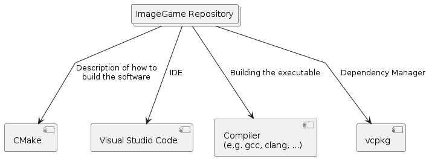
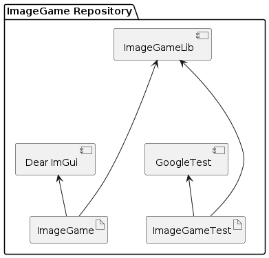
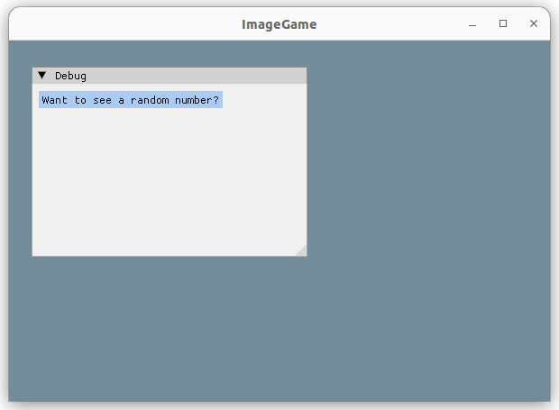
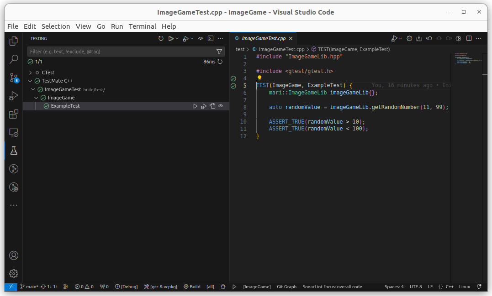

# ImageGame 🖼

This is the repository for the **ImageGame**.

## Getting Started

This section describes the components used by this repository to build the software.

### Directory Structure

* `/`: The root directory of this repository contains general files like the main `CMakeLists.txt` file describing how to build this software
* `/.vscode/`: This directory contains information for Visual Studio Code to find the CMake Kits
* `/doc/`: This directory contains documentation files
* `/cmake/`: This directory contains files required for CMake to properly describe the toolchain
* `/out/`: This directory contains the (auto-generated) plantuml png diagrams
* `/src/`: This directory contains the source code for the **ImageGame**
* `/test/`: This directory contains the test source code

### Required Tools

To build the software (and edit the source code) the **ImageGame** depends on the following tools:

* **CMake**: [CMake](https://cmake.org/download/#latest) is used to describe how to build the provided source code from this repository into an executable
* **Visual Studio Code**: [VS Code](https://code.visualstudio.com/) is the preferred IDE to modify the source code (although this is not strictly required - you're free to use whichever IDE you like 😎). To easiliy build and modify this project install the following extensions
  * CMake Tools
  * C/C++ Extension Pack
  * C++ TestMate
  * Git Graph
* **Compiler**: To create an executable from the source code you need a compiler. [Gcc](https://gcc.gnu.org/) or [Clang](https://clang.llvm.org/) might be good options.
* **vcpkg**: To manage/gather the external dependencies of the **ImageGame** the tool [vcpkg](https://vcpkg.io/en/) is used.

Altough this repository is cross-platform compatible it might simplify the development when using a **Linux** system.

### ImageGame Repository Structure

The source code of the **ImageGame** repository is structure as follows

* **ImageGameLib**: This *library* contains the central logic of the game
* **DearImGui**: The GUI is realized by the [Dear ImGui](https://github.com/ocornut/imgui) library. This ibrary is gathered by the vcpkg dependency manager automatically.
* **ImageGame**: This is the final *executable* of the game. It makes use of the *ImageGameLib* and the *Dear ImGui*.
* **GoogleTest**: The tests use the [GoogleTest](https://github.com/google/googletest) framework. This ibrary is gathered by the vcpkg dependency manager automatically.

### Building the **ImageGame** executable

To build the software follow these steps:

1. Install the required tools (described above)
1. Clone this repository
1. Clone the vcpkg repository (locally into this repo directory) via
  `git clone https://github.com/Microsoft/vcpkg.git`
1. Run the boostrap script to build vcpkg (from this repo directory)
  `./vcpkg/bootstrap-vcpkg.sh -disableMetrics`
1. Open Visual Studio Code
1. Execute *CMake: Select a Kit* and select the **gcc & vcpkg** kit
1. Execute *CMake: Configure*
1. Execute *CMake: Build*

### Executing the **ImageGame**

If you've built the **ImageGame** executable and execute it you will see the following example screen

### Executing the ImageGameTest in Visual Studio Code

You can easily acces all the unit tests within Visual Studio Code (and its TestMate C++ extension). The testing will look like this

